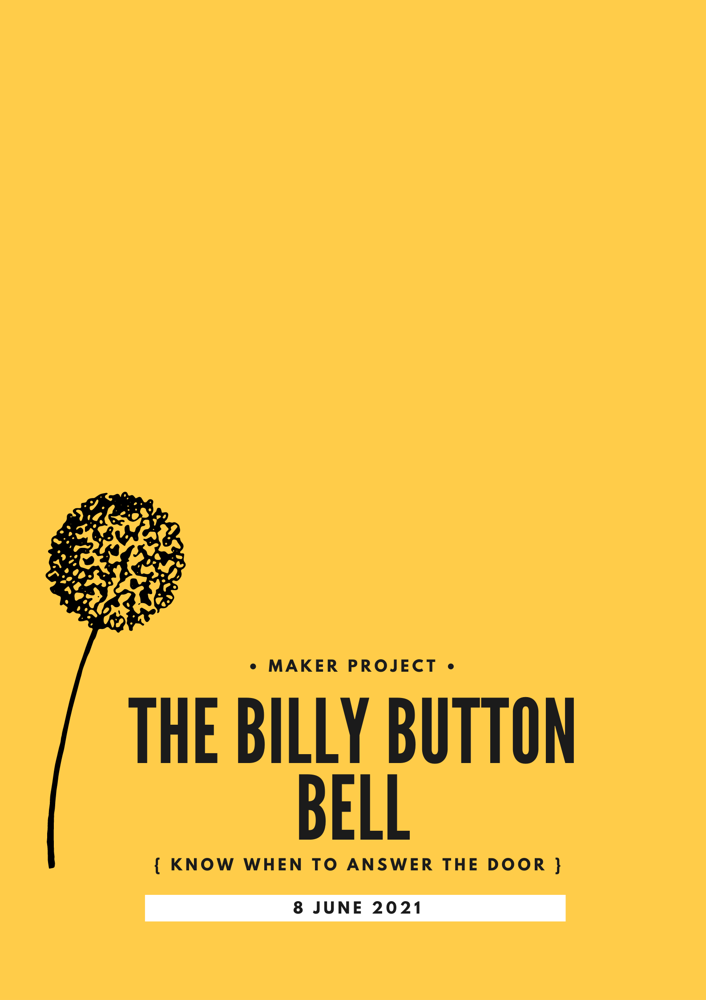
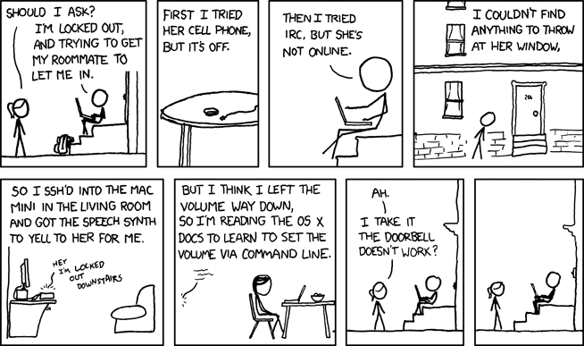

# Maker Project — The Billy Button Bell

**Maker:** [Sarah O'Connor](https://github.com/SarahEOConnor) 

<table><tr>
<td> </a> </td>
 </tr></table>
 
# What did I build and what was my motivation?
The Billy Button Bell is a prototype doorbell that uses passcodes and assigned songs/tones/chimes to indicate whether the person at the door is 'known' or 'unknown,' and sends a notification to the primary user. In building this prototype, I sought to find a simple solution to a known problem — my mum's unease at not knowing who is at the door when the doorbell is used, and the effort required for her to get to our current 'smart' doorbell's display. 

# Interacting with the Billy Button Bell

<table><tr>
<td> </a> </td>
 </tr></table>

# Tools
- [Raspberry Pi B+](https://www.raspberrypi.com/products/raspberry-pi-1-model-b-plus/)
- Mini Waterproof 360° Speaker with Bluetooth® Technology
- Python 
- VSCode 
- [Breadboard](https://learn.adafruit.com/collins-lab-breadboards-and-perfboards) 
- Acrylic (Frosted clear) 
- Keypad 
- Female/Male extension jumper wires
- Male/Male extension jumper wires 
- [Tactile button](https://projects.raspberrypi.org/en/projects/gpio-music-box/3)
- [Matrix Keypad](https://learn.adafruit.com/matrix-keypad)
- Screws
- Hot glue *very necessary at the nth hour*

# Skills Acquired 

- How to set up and use a Raspberry Pi B+
- Basic Python programming 
- Basic circuitry, including prototyping using a breadboard 
- How to use a soldering iron to solder the components of a circuit together [Tutorial](https://projects.raspberrypi.org/en/projects/getting-started-with-soldering)
- How to adapt a file in Adobe illustrator for laser cutting 
- How to source materials and use the [laser cutter](http://makerspace.anu.edu.au/page/tools/trotec360.html)  

# Questions Raised

1. Is there a role for the NBE in imagining technologies that are accessible for users with disabilities? What steps need to be taken to ensure that the technologies we build enable rather than constrain?
2. When it comes to bringing technologies into the home, do they disappear, or do they dictate? And, if we choose to introduce these types of devices into our homes, will we become more accepting of their presence in other spaces?
3. In the context of data collection in public spaces, like the front of a person's house, what constitutes 'meaningful consent'? In such cases, is consent taken or given?

# Acknowledgements
I want to acknowledge the tremendous amount of support that I received this semester from everyone
in the cohort. Thank you to the peer reviewers for your advice and kind words, as well as the Build teaching staff – Paul, Johan, Mina, Zac, Mem and Matthew — for your guidance, assistance and good humour. Special thanks to Chloe, Myrna, Kate, Jules and James for their help and positivity in the Studio and Maker Space in the lead up to the demo day. 

Outside of the Institute, a big thank you to Jordan and Sam from the Maker Space for their help and my family, who tolerated my ‘maker mess.’

The format for this README.md has been adapted from the [VDO-SLAM: A Visual Dynamic Object-aware SLAM System](https://github.com/halajun/VDO_SLAM) project page repository. 

# Resources 

Randall Munroe. n.d. ‘I’m An Idiot’. xkcd. Retrieved 25 May 2021 from https://xkcd.com/530/.

## Libraries

## Publications
